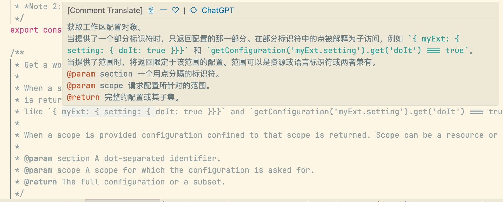
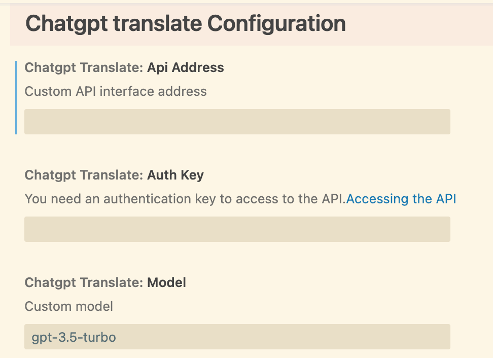
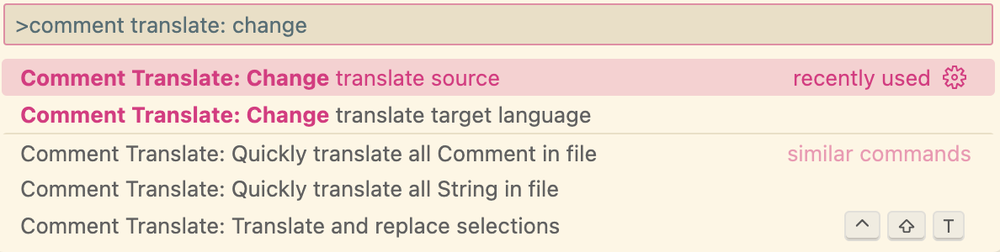
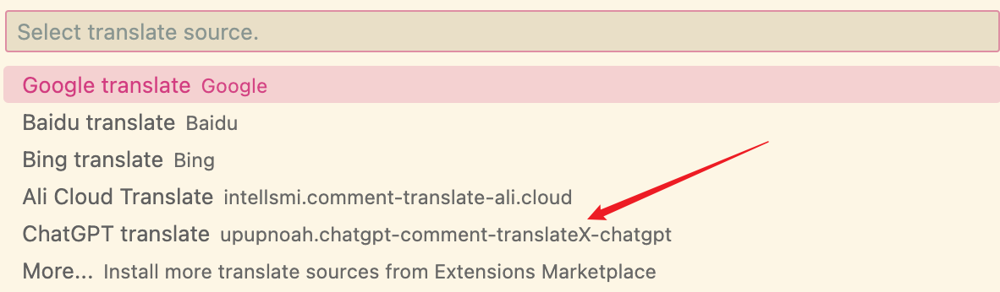

# chatgpt-comment-translateX

This plugin provides a translation source for the "comment-translate" plugin. It does not activate itself and will only start working when enabled.

## Translate
- Effect
    
- Custom settings
    

## Features
1. Provide translation capabilities
2. Provides online document link text
3. Support for custom models and domains
4. Support custom system prompts and user prompts

## Requirements
Please install '[comment-translate](https://github.com/intellism/vscode-comment-translate)' to use

## Usage
1. After installation, call the "Change translation source" command (CMD/CTRL + Shift + P) of "Comment Translate"
    
2. Check "ChatGPT translate" to configure the plugin API Key
    
3. Directly use the "Comment Translate" interactive mode to translate the corresponding text
4. Add the following settings in vscode's configuration.
    ```json
    "commentTranslate.source": "upupnoah.chatgpt-comment-translateX-chatgpt",
    "commentTranslate.targetLanguage": "zh-CN"
    ```

## Extension Settings

This extension contributes the following settings:

* `chatgptTranslate.authKey`: set to `authKey` to request
* `chatgptTranslate.apiAddress`: set as the requested address
* `chatgptTranslate.model`: customizing the model configuration

> Based on [chatgpt-comment-translate](https://github.com/kitiho/vscode-comment-translate-chatgpt) modification